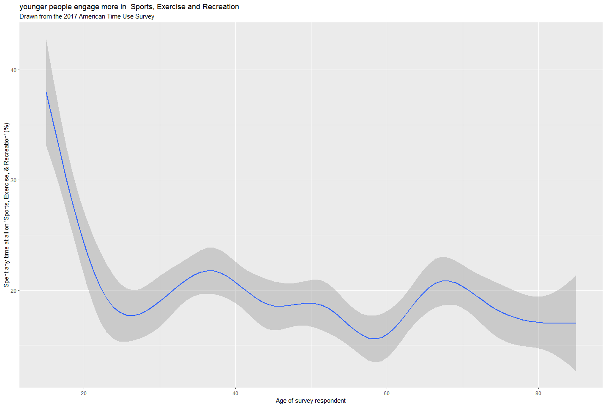

 

## A Short Paragraph
This plot shows how participation in sports, exercise and recreation in the USA is different at different ages.  The graph is based on data from the 2017 American Time Use Survey, in which respondents recorded how they spent all of their time on the day before they were interviewed.
The above graph shows the percentage of respondents, at different ages, who reported that they had spent any time at all on sports, exercise, and recreation the day in question.
The graph shows a fluctuating trend after the initial plunge, which started from over 35% of participants aged 15 to less than 20% of participants aged 23 to 30. It then fluctuated around 20 percentage with age, with the bottom point occurring around 25, late 50, and the oldest survey participants. The relative peak appeared in participants aged about 35 and nearly 68. In conclusion, younger people engage more in sports, exercise and recreation, especially for those aged 15 to 20 teenagers.
It should be noted that the data for the very oldest respondents --- those aged 80 and over --- is less reliable than at other ages, partly because of small numbers and partly because of the rounded recording of older ages in the published ATUS data.

