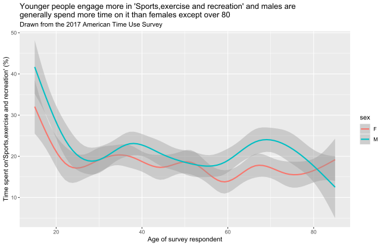

## Authors

- David Firth
- BAIYUN YUAN

(add your name to the above list when you have contributed your file)

## The contributions

### DAVID F

    08 10 14

This plot shows how participation in religious and spiritual activity in the USA is different at different ages.  The graph is based on data from the 2017 American Time Use Survey, in which
respondents recorded how they spent all of their time on the day before they were interviewed.
The above graph shows the percentage of respondents, at different ages, who reported that they had spent any time at all on religious and spiritual activity on the day in question.

The graph shows how such participation increases from less than 10% of 20-year-olds, to 20% or more of the oldest survey respondents.  It should be noted that the data for the very oldest respondents --- those aged 80 and over --- is less reliable than at other ages, partly because of small numbers and partly because of the rounded recording of older ages in the published ATUS data.
    
**The above is just an illustrative example of the sort of graph and text you might include in this file.  I fully expect that some of the graphs you'll produce will be more interesting than this one!**

          	
### ALEXANDER

    01 06 13

### BAIYUN

    08 13 18    
    

## A Short Paragraph
This plot shows that the percentage of individuals who participated in sports, exercise and recreation at different age and gender,using data from the USA, based on data from the 2017 American Time Use Survey(compile by the Bureau of Labour Statistics), in which respondents recorded how they spent all of their time on the day before they were interviewed.This Survey provides the structure of time alloction for people in different age and gender performing in various activities such as Socialising, Volunteering , Travelling and Childcare.

The above graph shows the percentage of respondents, at different ages and gender, who reported that they had spent any time at all on sports, exercise, and recreation the day in question.

When we ignore the gender influence,for the general trend,the graph is fluctuating after the initial plunge, which started from over 35% of participants aged 15 to less than 20% of participants aged 23 to 30. This may be due to the fact that we have more energy and spare time when we were young. It then fluctuated around 20 percentage with age, with the bottom point occurring around 25, late 50, and the oldest survey participants. The relative peak appeared in participants aged about 35 and nearly 68. In conclusion, younger people engage more in sports, exercise and recreation, especially for those aged 15 to 20 teenagers.

Consider the gender influence,we can observe from two different curves that men are generally more actively engaging in sports, exercise and recreation than women except over 80. It should be noted that 571 respondents aged either 80 or 85 are recorded in the total of 10233 respondents, which occupys nearly 5% in total, therefore it is also a dominant part and should be considered into conclusion. There is enough evidence to show that 85-year-old women spend nearly twice as much time on sports, exercise and recreation as 85-year-old men.

It also should be noted that the data for the very oldest respondents,the data for ages above 80 is only recorded participants aged 85 and this graph is lack of the age data between 81 and 84. Therefore, it is less reliable than at other ages, partly because of small numbers and partly because of the rounded recording of older ages in the published ATUS data. But, this doesn't affect the conclusion made above.

### BENJAMIN A

    01 05 08
     
### BENJAMIN S

    10 13 18
    
### CHRISTOPHER

    10 14 16
    
### DANA

    05 12 18

### DANIEL

    03 05 11

### DANIUS

    06 11 14
    
### DAVID

    01 02 05
    
### DENIS

    02 03 12
    
### FAN

    06 11 16
    
### HARRISON

    05 15 16
    
### JAMES

    03 08 14
    
### JAN

    04 13 15
    
### JIA

    07 08 18
    
### LANGLANG

    02 11 18
    
### LEWEI

    01 06 08
    
### LUYING

    06 08 15
    
### MACIEJ

    12 16 18
    
### MAHIR

    04 06 16
    
### MARIIA

    02 06 11
    
### MAXIM

    12 13 16
    
### MICHAEL

    04 10 12
    
### MINWOO

    04 08 12
    
### NAIXUAN

    08 14 16
    
### NATHAN

    11 12 15
    
### NEEL

    04 07 15
    
### NICOLE

    02 06 11
    
### NIRAJ

    03 06 13
    
### OPEOLORUN

    05 16 18
    
### REECE

    09 10 12
    
### RICHARD

    04 11 12
    
### SAMUEL

    06 09 13
    
### SANDEEP

    02 04 15
    
### SOPHIE

    04 12 18
    
### TIMOTHY

    06 09 11
    
### XI

    03 05 06
    
### XINGWEI

    01 03 07
    
### YIWEN

    02 10 14
    
### YUE

    03 12 18
    
### ZECHI

    01 04 07
    
### ZILIN

    04 10 15

